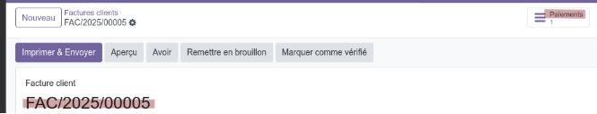
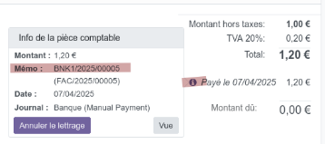
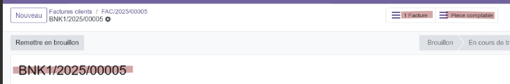

# Enregistrement des paiement entre Odoo 12 et Odoo 18

## ***Fonctionnement du règlement d’une facture***
   Le bouton « Paiements » en haut de la facture permet d’arriver sur le paiement BNK1/2025/00005 :

   

   Le widget de paiement en bas à droite permet d'arriver également sur ce même paiement BNK1/2025/00005 :

   

   Depuis ce paiement un bouton en haut permet de retourner à la facture et un deuxième bouton 'Pièce comptable' permet d’accéder à la facture du paiement (account.move) BNK1/2025/00005 :

   


## ***Facture client et facture du paiement en base de données :***

```
   select id,name,create_date,write_date from account_move;
      id      |      name           |        create_date        |         write_date         
   --------+-----------------+----------------------------+----------------------------
   **658328** | **FAC/2025/00005**  | 2025-04-07 06:35:59.398823 | 2025-04-07 06:37:25.469433    => Facture client
   **658329** | **BNK1/2025/00005** | 2025-04-07 06:37:25.469433 | 2025-04-07 06:37:25.469433    => Facture du paiement
```

## ***Paiement en base de données***
   Le champ `move_id` contient le lien entre le paiement et la facture du paiement
```
   select  id,move_id,name,memo,create_date from account_payment;
   id     | move_id |      name       |      memo      |        create_date         
   -------+---------+-----------------+----------------+----------------------------
   325264 | 658329  | BNK1/2025/00005 | FAC/2025/00005 | 2025-04-07 06:37:25.469433
```

## ***Crédits en circulation***
   Si je repasse en brouillon cette facture et que je la valide, les 2 boutons en haut sont toujours opérationnels, mais le widget du paiement en bas n'est plus relié à la facture et le message 'Crédits en circulation' apparaît :

   

   En cliquant sur  `Ajouter`, cela réactive le widget

   La différence entre ces 2 états est le champ `is_reconciled` dans `account_payment` et il y a le champ `payment_state` de la facture qui change

## ***Lien entre la facture client et le paiement***
```
   account_invoice_payment_rel => account_move__account_payment
   opta-s18=# select * from account_move__account_payment
   Lien entre la facure du client et le réglement
   invoice_id  | payment_id
   ------------+-----------
   **658328**  | **325264**
```


## Lien entre le paiement et la facture de paiment
Le paiement est bien bien enregistré, mais depuis celui-ci, il n'y a pas d'accès à la facture du paiement mais uniquement à la facture de base
Pour résoudre cela, il faut corriger le compte `471000` => `Actif circulant` (`asset_current`) et affecter ce compte au champ `Compte d'attente` du journal de banque
```
   update account_account set account_type='asset_current' where code_store->>'1'='471000';
   update account_journal set suspense_account_id=(select id from account_account where code_store->>'1'='471000' limit 1) where  type='bank';
```


## ***Analyse de la facture 2024-00315 (id=657951)***
   Le bouton `Paiement` en haut permet bien d’arriver sur la paiement `CUST.IN/2024/0344` (id=325132)
   Le widget du paiement en bas également. La table est correcte :
```
   invoice_id | payment_id
   -----------+------------
   **657951** |     325132
```

   Dans la facture du paiement le champ `memo` n'est pas renseigné.
   Mais c'est surtout le champ `move_id` qui pose problème car il est relié à la facture client et non pas à la facture du paiement.
   Du coup, le bouton `Pièce comptable` en haut du paiement affiche la facture client et non pas la facture du paiement.
```
   opta-s18=# select  id,move_id,name,memo,create_date from account_payment where id=325132;
   id      | move_id     |       name        | memo |        create_date        
   --------+-------------+-------------------+------+---------------------------
   325132  |  **657951** | CUST.IN/2024/0344 |      | 2024-12-17 07:56:31.80769
```
   Dans Odoo 12, j'ai le lien entre le paiement et la facture du paiement dans la table `account_move_line`
```
   opta-s12=# select id,payment_id,move_id from account_move_line where id=3027041;
   id       | payment_id | move_id
   ---------+------------+---------
   3027041  |     325132 |  658026
```

   Après avoir refait le lien correctement entre le paiement et la facture de paiement, le paiement permet bien d’accéder à sa facture.
   Mais le widget en bas n'affiche pas `Crédits en circulation` et le lien est perdu une fois la facture passée en brouillon et validée à nouveau.
   Tout est normal dans la facture client :
```
   opta-s18=# select id,name,origin_payment_id, payment_state, payment_reference from account_move where id=657527;
        id   |    name    | origin_payment_id | payment_state | payment_reference
   ---------+------------+-------------------+---------------+-------------------
   ` `657527 | 2024-00125 |                   | not_paid      | 2024-00125
```

   Tout est normal dans le lien entre la facture client et le  paiement
```
   opta-s18=# select * from account_move__account_payment where invoice_id=657527;
   invoice_id  | payment_id
   ------------+------------
   657527      | 324924
```

   C'est ce champ  `widget{} qui ne s'affiche pas
```
   <field name="invoice_payments_widget" colspan="2" nolabel="1" widget="payment"/>
   def _compute_payments_widget_reconciled_info(self):
   cf la fonction _get_all_reconciled_invoice_partials
```

   Le problème vient de ces tables :
```
   account_full_reconcile
   acount_partial_reconcile
```

   ## Fonctionnement du lien entre la facture et le paiement
   La table `account_partial_reconcile` fait le lien entre les lignes de la facture client (`debit_move_id`) et la facture du paiement (`credit_move_id`) et la table `account_full_reconcile`
```
   opta-s18=# select id,move_id from account_move_line where move_id in (658329,658328) order by id;
   id          | move_id
   ------------+---------
   3028327     |  658328
   **3028329** |  658328
   3028330     |  658329
   **3028331** |  658329
   3028335     |  658328

   opta-s18=# select  id,debit_move_id,credit_move_id,full_reconcile_id,write_date  from account_partial_reconcile  order by id desc limit 1;
 ```  

 ```
   id        | debit_move_id | credit_move_id | full_reconcile_id |        write_date         
   ----------+---------------+----------------+-------------------+---------------------------
   325331    |   **3028329** |    **3028331** |        **325322** | 2025-04-07 07:50:47.30836

   select * from account_full_reconcile order by id desc limit 5;
   id      | exchange_move_id | create_uid | write_uid |        create_date   |   write_date         
   --------+------------------+------------+-----------+-----------------------------------
   325322  |                  |          2 |         2 | 2025-04-07 07:50:47  | 2025-04-07 07:50:47
```


Le problème vient du champ `full_reconile_id` qui n'est pas renseigné :

```
select id,move_id,full_reconcile_id from account_move_line where move_id in (658329,658328);

   id      | move_id | full_reconcile_id
   --------+---------+-------------------
   3028327 |  658328 |                  
   3028329 |  658328 |            325322
   3028330 |  658329 |                  
   3028331 |  658329 |            325322
   3028335 |  658328 |                  

select id,move_id,full_reconcile_id from account_move_line where move_id in (657527,657570);
   id      | move_id | full_reconcile_id
   --------+---------+-------------------
   3025018 |  657527 |                  
   3025019 |  657527 |                  
   3025147 |  657570 |                  
   3025148 |  657570 |       
```           

   Le champ `full_reconcile_id` est bien migré, mais en passant la facture en brouillon, celui-ci est effacé ce qui est normal

   C'est également le cas avec une facture créée manuellement qui fonctionne.

   Sur une facture qui fonctionne, ce champ n'est pas remis par défaut mail le widget affiche `Crédits en circulation` permettant d'associé à nouveau le paiment à la facture

   Il faut donc regarder le fonctionnement ce ce champ et de la fonction `_compute_payments_widget_to_reconcile_info`

```
   <field name="invoice_outstanding_credits_debits_widget" class="oe_invoice_outstanding_credits_debits py-3" colspan="2" nolabel="1"
       widget="payment"
       invisible="state != 'posted' or not invoice_has_outstanding"/>
```

   Domain pour la recherche des factures dans `_compute_payments_widget_to_reconcile_info`
```
   [   ('account_id', 'in', [281]), ('parent_state', '=', 'posted'),
       ('partner_id', '=', False),
       ('reconciled', '=', False), '|', ('amount_residual', '!=', 0.0),
       ('amount_residual_currency', '!=', 0.0), ('balance', '<', 0.0)
   ]
```   

   Le problème vient du champ `partner_id` qui est à False
   Cela vient du champ `commercial_partner_id` qui n'est pas renseigné car il existe dans `account_invoice`, mais pas dans `account_move`
   Cela vient aussi du champ `parent_state` qui n'est pas renseigné dans `account_move_line`
```
   update account_move_line set parent_state=(select am.state from account_move am where move_id=am.id limit 1)
```


## Vous ne pouvez pas enregistrer un paiement car il n'y a plus rien à payer sur les écritures comptables sélectionnées.
Pour résoude ce problème : 
```
update account_move_line set amount_residual_currency=amount_residual;
update account_move_line set invoice_date=date;
update account_move_line aml set partner_id=(select partner_id from account_move where id=aml.move_id) where partner_id is not null;
```


## Si je repasse en brouillon et valide une factue migrée, le montant dû compte 2 fois la TVA
Il faut initialiser ces nouveaux champs : 
```
    update account_move set always_tax_exigible=false where always_tax_exigible is null;
    update account_move set checked=false where checked is null;
    update account_move set made_sequence_gap=false where made_sequence_gap is null;
    update account_move set posted_before=true where posted_before is null;
    update account_move set is_manually_modified=true where is_manually_modified is null;
    update account_move set quick_edit_total_amount=0 where quick_edit_total_amount is null;
    update account_move set is_storno=false where is_storno is null;
    update account_move set invoice_currency_rate=1 where invoice_currency_rate is null;
    update account_move set amount_untaxed_in_currency_signed=amount_untaxed_signed where amount_untaxed_in_currency_signed is null;
```


## Après avoir mis en brouillon et validé une facture, la TVA est compté en double (2 lignes de TVA dans les écrirures)
Solution : 
```
   update account_move_line set tax_repartition_line_id=(select id 
   from account_tax_repartition_line where tax_id=tax_line_id and repartition_type='tax' limit 1) 
   where tax_line_id is not null
```


## Impossible de trouver un plan comptable pour cette société.
Si je crée une facture juste après la migration sur une base vierge, j’ai ce message au moment de sélectionner un client : 
```
  Impossible de trouver un plan comptable pour cette société. Il vous faut le configurer.
  Veuillez aller dans les configurations comptables
```

La duplication d'une facture fonctionne ou la repasser en brouillon également. 
Mais impossible de créer une nouvelle facture même après avoir rechargé le plan comptable et enregistré des données dans la société
Après avoir fait une deuxième migration le problème a disparu...


## Montrer les fonctions de comptabilité complètes
Ajouter des personnes automatiquement dans le groupe pour voir la compta en entier
Les personnes y sont, mais tant que je ne modifie pas le groupe manuellement, cela ne fonctionne pas


## Devise en $ sur les factures
Avec une base vierge, la devise par défaut est en $
Mais elle passe en € toute seule en faisant je ne sais pas quoi
En repartant sur une nouvelle base, je n’ai pas rencontré ce problème


## L'opération ne peut pas être terminée : Une autre écriture avec le même nom existe déjà
En voulant créer une nouvelle facture, j'ai eu ce message : 
```
  L'opération ne peut pas être terminée : Une autre écriture avec le même nom existe déjà.
  ERROR: ERREUR:  la valeur d'une clé dupliquée rompt la contrainte unique « account_move_unique_name »
```
Problème avec le numéro de la prochaine facture
Il faut revoir les champs `sequence_prefix` et `sequence_number` dans `account_move`


## Le compte 467100 est de type créditeur, mais est utilisé dans une opération de vente
J’ai eu ce message en voulant dupliquer une facture avec des frais re-facturable sur le compte `467xxx` (ex : `2025-00120`):
```
 Opération invalide
 Le compte 467100 est de type créditeur, mais est utilisé dans une opération de vente.
```

Pour le résoudre, il faut changer le type du compte : 
```
  update account_account set account_type='liability_current' where code_store->>'1' like '467%';
```