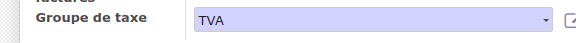
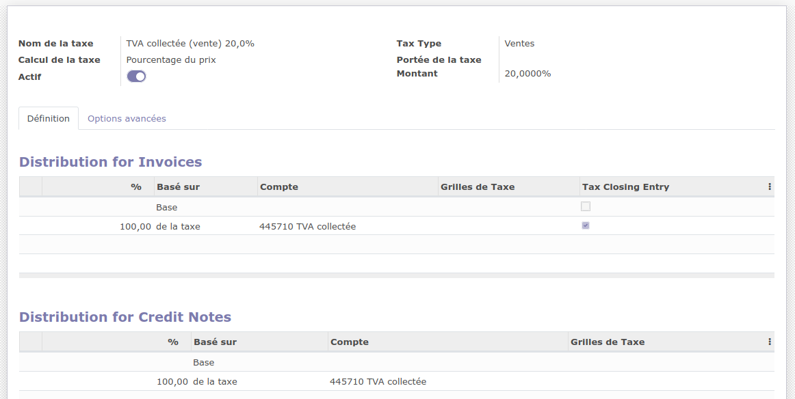
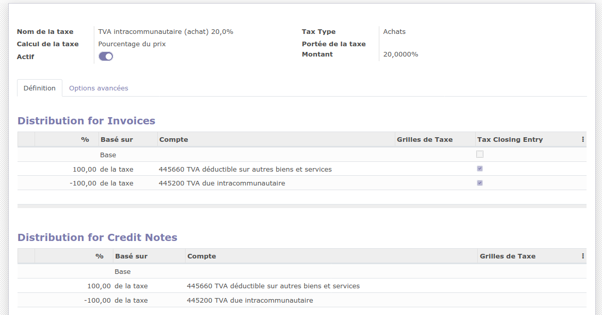
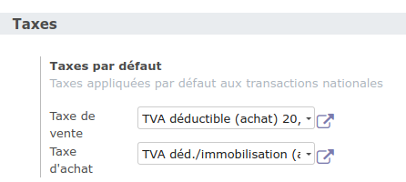
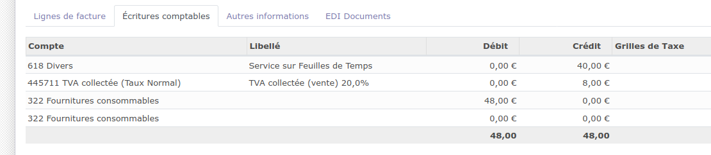
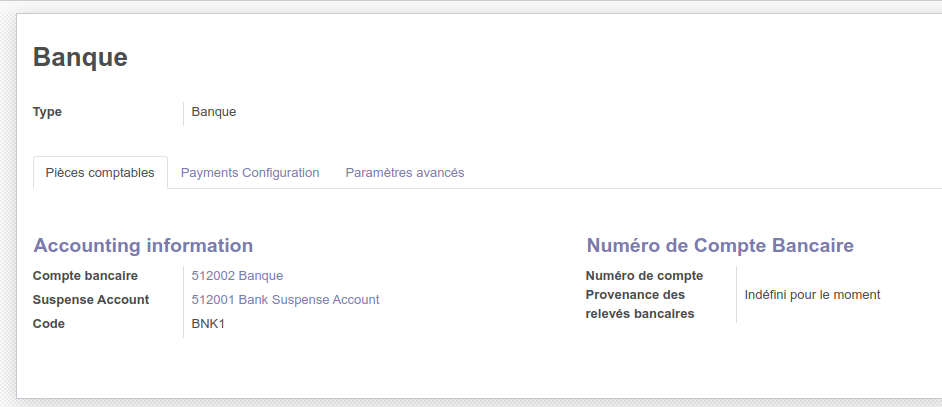
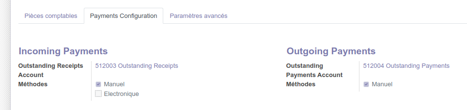
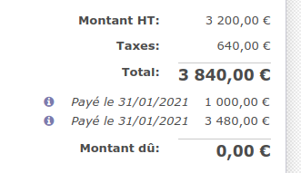

Migration Odoo Coheliance 8 vers 14
====

## A Faire manuellement après la migration

```
  ---------------------------------------------------------------- ------------
  RIB et banque à configurer                                       04/07/2021
  Logo société                                                     04/07/2021
  Droits d'accès des utilisateurs                                  04/07/2021
  Supprimer les assistants de paramétrage                          04/07/2021
  Configurer les favoris pour le tableau de bord de comptabilité   04/07/2021
  Arrêter nginx sur odoo8                                          04/07/2021
  Bug en cliquant sur le tchat                                     
  ---------------------------------------------------------------- ------------
```

## A Faire

```
  --------------------------------------------------------------------------------------------------------------------------------------------------------------------------------------------------------------------------------------------- ------
  Il manque les rapports à imprimer dans les affaires et faire fonctionner les icones dans l'affaire pour imprimer les rapport                                                                                                                  FAIT
  Vérifier les statistiques sur les factures (CA par mois en TTC et en HT et par article)                                                                                                                                                       FAIT
  Vérifier les taxes sur les factures fournisseurs avec des taux différent de 20 %                                                                                                                                                              FAIT
  Migrer la configuration des comptes et taxes dans les positions fiscales                                                                                                                                                                      FAIT
  Plus d'accès directe à la vue pivot depuis la liste des factures. Cette vue est désormais dans « Analyses »                                                                                                                                   FAIT
  Lors de la récupération du compte bancaire, le nom de la banque n'est pas récupéré car ce n'est plus un nom mais un lien vers une autre table. Le plus simple sera de recréer cette banque manuellement avec « INSERT INTO » dans le script   FAIT
  Logo de la company =\> Faire manuellement à la fin                                                                                                                                                                                            FAIT
  Il faudra migrer les 2 bases de Coheliance                                                                                                                                                                                                    FAIT
  --------------------------------------------------------------------------------------------------------------------------------------------------------------------------------------------------------------------------------------------- ------
```


# Fait

```
+--------------------------------------------------------+------------+
| La migration de la table res_company, fait planter la  | 17/12/2020 |
| base =\> Migrer seulement les champs                   |            |
|                                                        |            |
| Création de la fonction MigrationDonneesTable pour     |            |
| migrer les données correspondantes                     |            |
+--------------------------------------------------------+------------+
| Bandeau jaune en haut à droite et tchat qui tourne en  | 17/12/2020 |
| rond :                                                 |            |
|                                                        |            |
| {width="10.874cm" |            |
| height="1.879cm"}                                      |            |
|                                                        |            |
| C'est le mode superadmin                               |            |
+--------------------------------------------------------+------------+
| Message d'erreur à la connexion qui disparaît a bout   | 17/12/2020 |
| d'une seconde                                          |            |
|                                                        |            |
| Il manquait le res_partner (id=2). J'ai dupliqué le    |            |
| res_partner (id=3) et fait le lien avec les res_users  |            |
| correspond                                             |            |
+--------------------------------------------------------+------------+
| Pièces jointes et logo company                         |            |
+--------------------------------------------------------+------------+
| Le champ siret n'est plus dans res_company mais        | 17/12/2020 |
| déproté dans res_partner =\> Requête manuelle          |            |
+--------------------------------------------------------+------------+
| Le tchat en bas des clients ou factures ne fonctionne  | 17/12/2020 |
| pas :                                                  |            |
|                                                        |            |
| {width="5.556cm" |            |
| height="1.905cm"}                                      |            |
|                                                        |            |
| Il manquait le res_partner (id=2). J'ai dupliqué le    |            |
| res_partner (id=3) et fait le lien avec les res_users  |            |
| correspond                                             |            |
+--------------------------------------------------------+------------+
| La migration de la table res_partner entraîne le       | 17/12/2020 |
| plantage du tchat (roue tourne en haut à droite et en  |            |
| bas des clients)                                       |            |
|                                                        |            |
| =\> Il manque le res_partner id=2 =\> Ce qui entraîne  |            |
| ce problème                                            |            |
+--------------------------------------------------------+------------+
| La migration de la table res_users entraine ce fond    | 17/12/2020 |
| jaune au haut à droite :                               |            |
|                                                        |            |
| {width="11.351cm" |            |
| height="1.64cm"}                                       |            |
|                                                        |            |
| C'est lié au fait d'être connecté en superuser car     |            |
| l'id de l'admin est passé de 1 à 2 et l'id 1 est le    |            |
| superuser.                                             |            |
|                                                        |            |
| Il est possible de passer en mode superuser avec le    |            |
| menu du mode debuggage                                 |            |
|                                                        |            |
| J'ai essayé de modifier cette variable :               |            |
|                                                        |            |
| vim /opt/odoo-14/odoo/\_\_init\_\_.py                  |            |
|                                                        |            |
| \# The hard-coded super-user id (a.k.a. administrator, |            |
| or root user).                                         |            |
|                                                        |            |
| #SUPERUSER_ID = 1                                      |            |
|                                                        |            |
| SUPERUSER_ID = 2                                       |            |
|                                                        |            |
| Mais sans succès. Par contre en se connectant en       |            |
| simple utilisateur, ce bandeau n'apparaît pas          |            |
+--------------------------------------------------------+------------+
| Mettre la vue form des affaire en plein écran. Il faut | 22/01/2021 |
| installer ce module :                                  |            |
| https://odoo-community.org/s                           |            |
| hop/product/show-sheets-with-full-width-2688#attr=8778 |            |
+--------------------------------------------------------+------------+
| Il faudra remettre les utilisateurs dans les bons      | 22/01/2021 |
| groupes =\> MigrationResGroups                         |            |
+--------------------------------------------------------+------------+
| Pièces jointe res.partner, factures, affaire,\...      | 22/01/2021 |
+--------------------------------------------------------+------------+
| Pour les pièces jointes des affaires, il faudra        | 22/01/2021 |
| ajouter le tchat                                       |            |
+--------------------------------------------------------+------------+
| Ajouter le module « vente » dans les dépendances de    | 22/01/2021 |
| mon module                                             |            |
+--------------------------------------------------------+------------+
| Affaire : Avant , la vue de l'affaire occupait toute   | 22/01/2021 |
| la largeur de l'écran =\> Problème pour voir toutes    |            |
| les colonnes                                           |            |
+--------------------------------------------------------+------------+
| Problème avec la migration de res_country à cause des  | 23/01/2021 |
| traductions                                            |            |
|                                                        |            |
| De plus, ce pays à été ajouté : NETHERLANDS +          |            |
| Guadeloupe (3 clients concernés) =\> Ne rien faire     |            |
| pour cela                                              |            |
+--------------------------------------------------------+------------+
| Les factures annulées ne sont pas récupérer car elles  | 23/01/2021 |
| n'ont pas d'écriture comptables dans account_move =\>  |            |
| Ne rien faire                                          |            |
+--------------------------------------------------------+------------+
| Les taxes ne sont pas récupérées dans les factures     | 23/01/2021 |
+--------------------------------------------------------+------------+
| Les lignes de TVA apparaissent sur les lignes des      | 23/01/2021 |
| factures                                               |            |
+--------------------------------------------------------+------------+
| Les règlements (ex : BNK3/2021/0983) appariassent dans | 23/01/2021 |
| la liste des factures clients                          |            |
+--------------------------------------------------------+------------+
| Problème avec la traduction des articles dans les      | 23/01/2021 |
| factures (ex : 20-12-1268)                             |            |
|                                                        |            |
| LOCATION GERANCE REDEVANCE =\> LOYERS (copie) =\>      |            |
| id=100                                                 |            |
+--------------------------------------------------------+------------+
| Ajouter les taxes sur les commandes client             | 23/01/2021 |
+--------------------------------------------------------+------------+
| L'état de la commande et l'état de facturation des     | 23/01/2021 |
| commandes n'est pas récupéré                           |            |
+--------------------------------------------------------+------------+
| Impassible d'affiche un article :                      | 23/01/2021 |
|                                                        |            |
| loc_domain.append((\'location_id.parent_path\',        |            |
| \'=like\', location.parent_path + \'%\'))              |            |
|                                                        |            |
| TypeError: unsupported operand type(s) for +: \'bool\' |            |
| and \'str\'                                            |            |
+--------------------------------------------------------+------------+
| Le sous total des lignes des commandes est à 0         | 23/01/2021 |
+--------------------------------------------------------+------------+
| Erreur en voulant ajouter une ligne sur une facture    | 23/01/2021 |
| client :                                               |            |
|                                                        |            |
| ValueError: Wrong value for                            |            |
| account.move.line.account_internal_group: \'none\'     |            |
|                                                        |            |
| Cela est lié à ce champ calculé :                      |            |
|                                                        |            |
| account_internal_group =                               |            |
| fields.Selecti                                         |            |
| on(related=\'account_id.user_type_id.internal_group\', |            |
| string=\"Internal Group\", readonly=True)              |            |
|                                                        |            |
| Solution :                                             |            |
|                                                        |            |
| update account_account_type set                        |            |
| internal_group=\'asset\' where                         |            |
| internal_group=\'none\';                               |            |
+--------------------------------------------------------+------------+
| Problème calcul de la TVA dans facture fournisseur :   | 23/01/2021 |
|                                                        |            |
| {width="16.193cm" |            |
| height="7.779cm"}                                      |            |
|                                                        |            |
| Solution :                                             |            |
|                                                        |            |
| update account_tax set amount=100\*amount;             |            |
+--------------------------------------------------------+------------+
| Problème en voulant sélectionner le fournisseur dans   | 23/01/2021 |
| une facture fournisseur :                              |            |
|                                                        |            |
| {width="10.319cm" |            |
| height="1.349cm"}                                      |            |
|                                                        |            |
| Solution :                                             |            |
|                                                        |            |
| update res_partner set country_id=75 where             |            |
| country_id=255;                                        |            |
+--------------------------------------------------------+------------+
| Les traductions des pays ne sont pas les bonnes suite  | 23/01/2021 |
| migration table res_country =\> Suppression des        |            |
| traductions pour cette table.                          |            |
|                                                        |            |
| Si je recharge la langue, cela remet les mauvaises     |            |
| traductions ce qui ne convient donc pas :              |            |
+--------------------------------------------------------+------------+
| Rechercher pourquoi il manque des factures client et   | 23/01/2021 |
| fournisseur =\> Il manque les factures annulées =\> Ne |            |
| rien faire                                             |            |
+--------------------------------------------------------+------------+
| Enlever les écritures de banques dans les factures des | 23/01/2021 |
| clients                                                |            |
+--------------------------------------------------------+------------+
| Le montant de TVA n'est pas affiché :                  | 24/01/2021 |
| {width="8.07cm" |            |
| height="2.858cm"}                                      |            |
+--------------------------------------------------------+------------+
| La duplication d'une facture génère une ligne de TVA   | 05/02/21   |
| en plus lors du règlement                              |            |
|                                                        |            |
| =\> Pour cela, il faut créer les account_papyment      |            |
+--------------------------------------------------------+------------+
| Le fait de remettre une facture en brouillon, change   | 05/02/21   |
| sont numéro                                            |            |
+--------------------------------------------------------+------------+
| Impossible d'enregistrer un règlement sur les factures | 05/02/21   |
| importées                                              |            |
+--------------------------------------------------------+------------+
| Migration des taxes sur les lignes des factures        | 05/02/21   |
+--------------------------------------------------------+------------+
| Relier les règlements aux factures                     | 05/02/21   |
|                                                        |            |
| =\> Dans Odoo 8, il y a un lien entre la facture et    |            |
| account_move_line dans l'onglet règlement =\> Partir   |            |
| de ça pour avoir le lien et créer les account_papyment |            |
+--------------------------------------------------------+------------+
| la table account_tax a beaucoup changée (del           | 05/02/21   |
| tax_code_id et add tax_group_id)                       |            |
|                                                        |            |
| Cela a une incidence sur la migration de la table      |            |
| account_invoice_tax                                    |            |
+--------------------------------------------------------+------------+
| Dans les factures, la colonne « État du paiement » est | 05/02/21   |
| vide                                                   |            |
+--------------------------------------------------------+------------+
| Dans les écritures comptables des factures, il manque  | 05/02/21   |
| une ligne concernant la TVA et apparemment, il faut    |            |
| recalculer la TVA pour le champ price_total de         |            |
| account_move_line                                      |            |
+--------------------------------------------------------+------------+
| Impossible de remettre une facture client en brouillon | 05/02/21   |
|                                                        |            |
| File \"/opt/odoo-14/odoo/http.py\", line 314, in       |            |
| \_handle_exception                                     |            |
|                                                        |            |
| raise exception.with_traceback(None) from new_cause    |            |
|                                                        |            |
| ValueError: Expected singleton: res.currency()         |            |
+--------------------------------------------------------+------------+
| Mettre le bon signe sur ces champs des factures        | 05/02/21   |
|                                                        |            |
| amount_untaxed_signed=%s,                              |            |
|                                                        |            |
| amount_tax_signed=%s,                                  |            |
|                                                        |            |
| amount_total_signed=%s,                                |            |
|                                                        |            |
| amount_residual_signed=%s                              |            |
+--------------------------------------------------------+------------+
| Problème pour enregistrer un règlement sur une facture | 05/02/21   |
| client                                                 |            |
|                                                        |            |
| You can\'t create a new payment without an outstanding |            |
| payments/receipts accounts set on the Liquidités       |            |
| journal.                                               |            |
+--------------------------------------------------------+------------+
| Sur la facture dans Odoo 14, les lignes de TVA ne sont | 04/02/21   |
| plus visible dans l'onglet « Autres informations »     |            |
+--------------------------------------------------------+------------+
| Dans les factures récupérer les règlements et les      | 05/02/21   |
| états du règlement                                     |            |
+--------------------------------------------------------+------------+
| Rechercher les autres liens avec les id des factures   | 05/02/21   |
| suite migration account_invoice vers account_move      |            |
+--------------------------------------------------------+------------+
| Récupérer les numéros des factures à l'état brouillon  | 05/02/21   |
| =\> Pas possible                                       |            |
+--------------------------------------------------------+------------+
| Plantage pour créer ou afficher un article             | 06/02/21   |
+--------------------------------------------------------+------------+
| Dans la fiche article, impossible de sélectionner des  | 06/02/21   |
| comptes =\> Migration comptes à revoir                 |            |
|                                                        |            |
| Revoir les comptes de dépenses et de revenir dans les  |            |
| catgéories articles                                    |            |
+--------------------------------------------------------+------------+
| Sur une facture fournisseur, je n'ai plus la           | 06/02/21   |
| possibilité d'indiquer qu'elle est facturée            |            |
+--------------------------------------------------------+------------+
| Voir pour configurer les journaux automatiquement pour | 06/02/21   |
| faire fonctionner les règlements (Compte bancaire,     |            |
| Suspense Account, Outstanding Receipts Account,        |            |
| Outstanding Payments Account, Méthodes)                |            |
+--------------------------------------------------------+------------+
| Remettre l'historique des modifications des factures   | 06/02/21   |
| (l'id de la facture a changé)                          |            |
+--------------------------------------------------------+------------+
| bouton « Calculer » du bilan pédagogique ne fonctionne | 06/02/21   |
| pas                                                    |            |
+--------------------------------------------------------+------------+
| Le menu refacturation total des frais ne fonctionne    | 08/02/21   |
| pas                                                    |            |
+--------------------------------------------------------+------------+
| Les menus « Suivi banque et caisse » ne fonctionnent   | 08/02/21   |
| pas                                                    |            |
+--------------------------------------------------------+------------+
| res_partenr_view.xml =\> Beaucoup de lignes en         | 08/02/21   |
| commentaire                                            |            |
+--------------------------------------------------------+------------+
| Il manque le menu « CRM / Commandes »                  | 08/02/21   |
+--------------------------------------------------------+------------+
| Il faudra migrer les séquences : ir_sequence. Revoir   | 10/02/21   |
| la numération des documents (affaire, factures,\...)   |            |
+--------------------------------------------------------+------------+
| L'icône devant les lignes des frais n'est pas affiché  | 10/02/21   |
| et il ne fonctionne pas                                |            |
+--------------------------------------------------------+------------+
| L'icône devant les lignes des factures fournisseur     | 10/02/21   |
| n'est pas affiché et il ne fonctionne pas              |            |
+--------------------------------------------------------+------------+
| Affaire : Icônes manquant dans l'onglet                | 10/02/21   |
| « Intervenant »                                        |            |
+--------------------------------------------------------+------------+
|                                                        |            |
+--------------------------------------------------------+------------+
|                                                        |            |
+--------------------------------------------------------+------------+
```


# res_users

```
coheliance14_migre=# select id,login from res_users order by id;

id \| login

\-\-\--+\-\-\-\-\-\-\-\-\-\-\-\-\-\-\-\-\-\-\-\-\-\-\-\-\-\-\-\-\--

1 \| admin

3 \| public

4 \| portaltemplate

5 \| florence@coheliance.com

coheliance14=# select id,login from res_users order by id;

id \| login

\-\-\--+\-\-\-\-\-\-\-\-\-\-\-\-\-\-\--

1 \| \_\_system\_\_

2 \| admin

3 \| default

4 \| public

Solution : Dupliquer admin :

champs=\'active,password,company_id,partner_id,notification_type\'

SQL=\"\"\"

INSERT INTO res_users(id,login,\"\"\"+champs+\"\"\")

SELECT 2,\'\_\_system\_\_\',\"\"\"+champs+\"\"\"

FROM res_users WHERE id=1

\"\"\"

cr_dst.execute(SQL)

cnx_dst.commit()
```


# Invcoice


```
 1. account.invoice -\> account.move

2. account.invoice.line -\> account.move.line

3. account.invoice.tax -\> account.move.line

4. account.voucher -\> account.move

5. account.voucher.line -\> account.move.line
```


# Différences entre les modules

```
migration-odoo.py compare_modules \| grep state_src=installed \| grep -v
state_dst=installed

\- account_accountant state_src=installed state_dst=uninstallable OK OK

\- account_cancel state_src=installed OK

\- account_chart state_src=installed OK

\- account_voucher state_src=installed OK

\- auth_crypt state_src=installed OK

\- base_action_rule state_src=installed OK

\- decimal_precision state_src=installed OK

\- document state_src=installed OK

\- edi state_src=installed OK

\- email_template state_src=installed OK

\- hr_timesheet_invoice state_src=installed OK

\- hr_timesheet_sheet state_src=installed OK

\- im_chat state_src=installed OK

\- im_odoo_support state_src=installed OK

\- is_coheliance state_src=installed OK

\- knowledge state_src=installed OK

\- portal_project state_src=installed OK

\- portal_sale state_src=installed OK

\- portal_stock state_src=installed OK

\- procurement state_src=installed OK

\- report state_src=installed OK

\- sale_order_dates state_src=installed OK

\- share state_src=installed OK

\- web_calendar state_src=installed OK

\- web_diagram state_src=installed OK

\- web_export_view state_src=installed OK

\- web_gantt state_src=installed OK

\- web_graph state_src=installed OK

\- web_kanban state_src=installed OK

\- web_kanban_sparkline state_src=installed OK

\- web_list_view_sticky state_src=installed OK

\- web_m2x_options state_src=installed OK

\- web_tests state_src=installed OK

\- web_tree_many2one_clickable state_src=installed OK

\- web_view_editor state_src=installed OK

```

# Différences entre les tables

```
odoo@buster:/sf_dev_odoo\$ ./migration-odoo/migration-odoo.py
compare_tables \| grep test3

6/757 account_account_financial_report_type 15 2 test1 test2 test3

29/757 account_analytic_journal 3 10 test1 test2 test3

69/757 account_financial_report 8 14 test1 test2 test3

79/757 account_fiscalyear 5 12 test1 test2 test3

90/757 account_invoice 4748 44 test1 test2 test3

93/757 account_invoice_line 6650 21 test1 test2 test3

94/757 account_invoice_line_tax 4626 2 test1 test2 test3

97/757 account_invoice_tax 3340 18 test1 test2 test3

106/757 account_journal_cashbox_line 150 7 test1 test2 test3

111/757 account_journal_period 270 11 test1 test2 test3

128/757 account_move_reconcile 1319 8 test1 test2 test3

146/757 account_period 65 13 test1 test2 test3

175/757 account_tax_code 97 13 test1 test2 test3

176/757 account_tax_code_template 120 12 test1 test2 test3

200/757 account_voucher 1338 32 test1 test2 test3

201/757 account_voucher_line 2431 17 test1 test2 test3

259/757 crm_case_categ 10 8 test1 test2 test3

260/757 crm_case_section 1 24 test1 test2 test3

261/757 crm_case_stage 7 13 test1 test2 test3

287/757 crm_payment_mode 4 7 test1 test2 test3

288/757 crm_phonecall 815 26 test1 test2 test3

299/757 crm_tracking_medium 5 7 test1 test2 test3

300/757 crm_tracking_source 3 6 test1 test2 test3

308/757 document_directory 9 17 test1 test2 test3

309/757 document_directory_content 2 13 test1 test2 test3

310/757 document_directory_content_type 1 9 test1 test2 test3

314/757 email_template 14 29 test1 test2 test3

342/757 hr_timesheet_invoice_factor 4 8 test1 test2 test3

347/757 im_chat_presence 11 9 test1 test2 test3

392/757 ir_sequence_type 25 7 test1 test2 test3

400/757 ir_values 424 15 test1 test2 test3

436/757 l10n_fr_line 130 9 test1 test2 test3

437/757 l10n_fr_report 2 7 test1 test2 test3

456/757 mail_group 1 15 test1 test2 test3

457/757 mail_group_res_group_rel 1 2 test1 test2 test3

468/757 mail_notification 4594 5 test1 test2 test3

501/757 procurement_order 4 27 test1 test2 test3

504/757 procurement_rule 5 24 test1 test2 test3

**517/757 product_price_history 109 9 test1 test2 test3**

519/757 product_price_type 2 9 test1 test2 test3

522/757 product_pricelist_type 2 7 test1 test2 test3

523/757 product_pricelist_version 2 11 test1 test2 test3

539/757 product_uom 19 11 test1 test2 test3

540/757 product_uom_categ 5 6 test1 test2 test3

602/757 res_font 3 9 test1 test2 test3

612/757 res_partner_bank_type 2 8 test1 test2 test3

613/757 res_partner_bank_type_field 4 10 test1 test2 test3

618/757 res_request_link 9 8 test1 test2 test3

634/757 sale_member_rel 1 2 test1 test2 test3

638/757 sale_order_invoice_rel 439 2 test1 test2 test3

644/757 sale_order_tax 425 2 test1 test2 test3

650/757 section_stage_rel 7 2 test1 test2 test3

676/757 stock_incoterms 15 8 test1 test2 test3

707/757 stock_quant_move_rel 1 2 test1 test2 test3

751/757 wkf 5 8 test1 test2 test3

752/757 wkf_activity 45 16 test1 test2 test3

753/757 wkf_instance 6499 6 test1 test2 test3

754/757 wkf_transition 71 13 test1 test2 test3

756/757 wkf_witm_trans 222 2 test1 test2 test3

757/757 wkf_workitem 6499 5 test1 test2 test3

test3 : nb_src\>0 and nb_dst==\'\' =\> Données dans la table source et
table de destination inexistante

```

## Réinitialisation du mot de passe

```
# SQL=\"update res_users set
password=\'\$pbkdf2-sha512\$25000\$5rzXmj6SCQYLiKK1g.cwVCztAf3WfBxvFg6b7w\'\"
# cr_dst.execute(SQL)
# cnx_dst.commit()
```

## ir_attachment

```
odoo@buster:/sf_dev_odoo\$ ./migration-odoo/migration-odoo.py
compare_champs ir_attachment

\- champ type_src type_dst ok_src ok_dst nb test_nb

\- access_token character varying ok_dst 0

\- checksum character varying(40) ok_dst 0

\- company_id integer integer ok_src ok_dst 1

\- create_date timestamp without time zone timestamp without time zone
ok_src ok_dst 453 nb\>1

\- create_uid integer integer ok_src ok_dst 10 nb\>1

\- datas_fname character varying ok_src 391 nb\>1

\- db_datas bytea bytea ok_src ok_dst 1

\- description text text ok_src ok_dst 2 nb\>1

\- file_size integer integer ok_src ok_dst 416 nb\>1

\- file_type character varying ok_src 13 nb\>1

\- id integer integer ok_src ok_dst 453 nb\>1

\- index_content text text ok_src ok_dst 322 nb\>1

\- mimetype character varying ok_dst 0

\- name character varying character varying ok_src ok_dst 395 nb\>1

\- original_id integer ok_dst 0

\- parent_id integer ok_src 1

\- partner_id integer ok_src 99 nb\>1

\- public boolean ok_dst 0

\- res_field character varying ok_dst 0

\- res_id integer integer ok_src ok_dst 121 nb\>1

\- res_model character varying character varying ok_src ok_dst 8 nb\>1

\- res_name character varying ok_src 142 nb\>1

\- store_fname character varying character varying ok_src ok_dst 426
nb\>1

\- type character varying character varying ok_src ok_dst 1

\- url character varying(1024) character varying(1024) ok_src ok_dst 5
nb\>1

\- user_id integer ok_src 10 nb\>1

\- write_date timestamp without time zone timestamp without time zone
ok_src ok_dst 450 nb\>1

\- write_uid integer integer ok_src ok_dst 1

# Migration account_invoice dans account_move

coheliance8=# select id,number,type,move_id from account_invoice where
id=4930;

id \| number \| type \| move_id

\-\-\-\-\--+\-\-\-\-\-\-\-\-\-\-\--+\-\-\-\-\-\-\-\-\-\-\-\--+\-\-\-\-\-\-\-\--

4930 \| 20-12-1268 \| out_invoice \| 7236

coheliance8=# select id,product_id,substring(name,1,40) from
account_invoice_line where invoice_id=4930;

id \| product_id \| substring

\-\-\-\-\--+\-\-\-\-\-\-\-\-\-\-\--+\-\-\-\-\-\-\-\-\-\-\-\-\-\-\-\-\-\-\-\-\-\-\-\-\-\-\-\-\-\-\-\-\-\-\-\-\-\-\-\-\--

7360 \| 100 \| REDEVANCE LOCATION GERANCE DECEMBRE 2020

7361 \| 100 \| Redevance mensuelle relative au fonds de

7362 \| 100 \| \* Redevance relative aux éléments incorp

7363 \| 100 \| + Majoration de 5 % du CA mensuel HT fac

coheliance8=# select id,name from account_move where id=7236;

id \| name

\-\-\-\-\--+\-\-\-\-\-\-\-\-\-\-\--

7236 \| 20-12-1268

coheliance8=# select id,name from account_move_line where move_id=7236;

id \| name

\-\-\-\-\-\--+\-\-\-\-\-\-\-\-\-\-\-\-\-\-\-\-\-\-\-\-\-\-\-\-\-\-\-\-\-\-\-\-\-\-\-\-\-\-\-\-\-\-\-\-\-\-\-\-\-\-\-\-\-\-\-\-\-\-\-\-\-\-\-\-\--

20662 \| REDEVANCE LOCATION GERANCE DECEMBRE 2020

20663 \| Redevance mensuelle relative au fonds de commerce :

20664 \| \* Redevance relative aux éléments incorporels

20665 \| + Majoration de 5 % du CA mensuel HT facturé (cf. tableau des
ve

20666 \| TVA 20,0%

20667 \| SO382

# État des commandes

## Odoo 14

invoice_status = fields.Selection(\[

(\'upselling\', \'Upselling Opportunity\'),

(\'invoiced\', \'Fully Invoiced\'),

(\'to invoice\', \'To Invoice\'),

(\'no\', \'Nothing to Invoice\')

\], string=\'Invoice Status\', compute=\'\_get_invoice_status\',
store=True, readonly=True)

state = fields.Selection(\[

(\'draft\', \'Quotation\'),

(\'sent\', \'Quotation Sent\'),

(\'sale\', \'Sales Order\'),

(\'done\', \'Locked\'),

(\'cancel\', \'Cancelled\'),

\], string=\'Status\', readonly=True, copy=False, index=True,
tracking=3, default=\'draft\')

## Odoo 8

\'state\': fields.selection(\[

(\'draft\', \'Draft Quotation\'),

(\'sent\', \'Quotation Sent\'),

(\'cancel\', \'Cancelled\'),

(\'waiting_date\', \'Waiting Schedule\'),

(\'progress\', \'Sales Order\'),

(\'manual\', \'Sale to Invoice\'),

(\'shipping_except\', \'Shipping Exception\'),

(\'invoice_except\', \'Invoice Exception\'),

(\'done\', \'Done\'),

\], \'Status\', readonly=True, copy=False, help=\"Gives the status of
the quotation or sales order.\\

\'invoiced_rate\': fields.function(\_invoiced_rate, string=\'Invoiced
Ratio\', type=\'float\'),

\'invoiced\': fields.function(\_invoiced, string=\'Paid\',

fnct_search=\_invoiced_search, type=\'boolean\', help=\"It indicates
that an invoice has been paid.\"),

\'invoice_exists\': fields.function(\_invoice_exists,
string=\'Invoiced\',

fnct_search=\_invoiced_search, type=\'boolean\', help=\"It indicates
that sales order has at least one invoice.\"),

# Problème avec la table « account_tax »

la table account_tax a beaucoup changée (del tax_code_id et add
tax_group_id)

Cela a une incidence sur la migration de la table account_invoice_tax

Du coup, je pense qu'il ne faut pas la migrer brutalement

Si je ne migre pas la table « account_tax », je vais devoir changer les
id des taxes partout (sale.order, purcharse.order. invoice, product,...)
ce qui ne me parait pas envisageable

coheliance8=# select id,tax_code_id,name from account_tax where id in
(1,2,7,8,12,30) order by id ;

id \| tax_code_id \| name

\-\-\--+\-\-\-\-\-\-\-\-\-\-\-\--+\-\-\-\-\-\-\-\-\-\-\-\-\-\-\-\-\-\-\-\-\-\-\-\-\-\-\-\-\-\-\-\-\-\-\-\-\-\-\-\-\-\-\-\-\-\-\-\--

1 \| 30 \| TVA déductible (achat) 20,0%

2 \| 12 \| TVA collectée (vente) 20,0%

7 \| 33 \| TVA déductible (achat) 10,0%

8 \| 36 \| TVA déductible (achat) 5,5%

12 \| 33 \| TVA déductible (achat) 10,0% TTC

30 \| \| TVA 0% autres opérations non imposables (vente)

(6 lignes)

coheliance8=# \\q

odoo@buster:/sf_dev_odoo\$ psql coheliance14

psql (11.9 (Debian 11.9-0+deb10u1))

Saisissez « help » pour l\'aide.

coheliance14=# select id,name from account_tax where id in
(1,2,7,8,12,30) order by id ;

id \| name

\-\-\--+\-\-\-\-\-\-\-\-\-\-\-\-\-\-\-\-\-\-\-\-\-\-\-\-\-\-\-\-\-\-\-\-\-\-\-\-\-\-\-\-\-\--

1 \| TVA collectée (vente) 20,0%

2 \| TVA à l\'encaissement (vente) 10,0%

7 \| TVA réduite à l\'encaissement (vente) 5.5%

8 \| TVA collectée (vente) 2,1%

12 \| TVA à l\'encaissement (vente) 20,0% TTC

30 \| TVA déductible (achat) 8,5% TTC

(6 lignes)

Il y a aussi ce nouveau champ à migrer :

{width="15.24cm"
height="1.138cm"}Mettre plutôt 1 par défaut et non pas 2 qui correspond
au groupe TVA 0 %

odoo@buster:/\$ echo \"select id,tax_code_id,name from account_tax where
tax_code_id in (3,12) order by id\" \| psql coheliance8

id \| tax_code_id \| name

\-\-\--+\-\-\-\-\-\-\-\-\-\-\-\--+\-\-\-\-\-\-\-\-\-\-\-\-\-\-\-\-\-\-\-\-\-\-\-\-\-\-\-\--

2 \| 12 \| TVA collectée (vente) 20,0%

odoo@buster:/\$ echo \"select id,code,name from account_tax_code where
id in(3,12) order by id\" \| psql coheliance8

id \| code \| name

\-\-\--+\-\-\-\-\-\-\-\-\-\-\-\-\-\-\-\-\-\-\-\-\-\-\-\-\-\-\-\-\-\-\-\--+\-\-\-\-\-\-\-\-\-\-\-\-\-\-\-\--

3 \| TVA collectée 20.0% (Base H.T.) \| Base H.T. 20.0%

12 \| TVA collectée 20.0% \| TVA 20.0%

odoo@buster:/\$ echo \"select id,name,tax_code_id,debit,credit from
account_move_line where move_id=7191\" \| psql coheliance8

id \| name \| tax_code_id \| debit \| credit

\-\-\-\-\-\--+\-\-\-\-\-\-\-\-\-\-\-\-\-\-\-\-\-\-\-\-\-\-\-\-\-\-\-\-\-\-\-\-\-\-\--+\-\-\-\-\-\-\-\-\-\-\-\--+\-\-\-\-\-\-\-\--+\-\-\-\-\-\-\-\--

20536 \| / \| \| 3840.00 \| 0.00

20534 \| BON DE COMMANDE N° 0100-0000006079 \| 3 \| 0.00 \| 3200.00

20535 \| TVA 20,0% \| 12 \| 0.00 \| 640.00

odoo@buster:/sf_dev_odoo\$ echo \"select
aml.id,aml.name,aml.tax_code_id,aml.debit,aml.credit,at.id from
account_move_line aml inner join account_tax at on
aml.tax_code_id=at.tax_code_id where move_id=7191\" \| psql coheliance8

id \| name \| tax_code_id \| debit \| credit \| id

\-\-\-\-\-\--+\-\-\-\-\-\-\-\-\-\--+\-\-\-\-\-\-\-\-\-\-\-\--+\-\-\-\-\-\--+\-\-\-\-\-\-\--+\-\-\--

20535 \| TVA 20,0% \| 12 \| 0.00 \| 640.00 \| 2
```


# Migration des taxes

{width="27.7cm"
height="13.921cm"}

{width="27.7cm"
height="14.536cm"}

A Faire :

-   Lien entre les taxes et les articles =\> Après la migration des
    articles
-   Taxes par défaut à la création des articles :

{width="11.8cm"
height="5.292cm"}

Ces champs dans res_company =\> FAIT

account_sale_tax_id =2

account_purchase_tax_id = 1

# Migration des comptes

Le menu pour accéder aux comptes n'existe plus dans Odoo 14

# Bug facturation

Les 2 dernières lignes ne sont pas normales et le compte lié à l'article
est à revoir

Dans la fiche article, impossible de sélectionner des comptes =\>
Migration comptes à revoir

Revoir les comptes de dépenses et de revenir dans les catgéories
articles

{width="27.7cm"
height="6.089cm"}

# Journaux

{width="22.65cm"
height="9.786cm"}

{width="24.158cm"
height="5.689cm"}

# Liens entre les factures et les règlements


```
\@api.depends(\'move_type\', \'line_ids.amount_residual\')

def \_compute_payments_widget_reconciled_info(self):

for move in self:

payments_widget_vals = {\'title\': \_(\'Less Payment\'),
\'outstanding\': False, \'content\': \[\]}

if move.state == \'posted\' and move.is_invoice(include_receipts=True):

payments_widget_vals\[\'content\'\] =
move.\_get_reconciled_info_JSON_values()

def is_invoice(self, include_receipts=False):

return self.move_type in self.get_invoice_types(include_receipts)

\@api.model

def get_invoice_types(self, include_receipts=False):

return \[\'out_invoice\', \'out_refund\', \'in_refund\',
\'in_invoice\'\] + (include_receipts and \[\'out_receipt\',
\'in_receipt\'\] or \[\])

def \_get_reconciled_info_JSON_values(self):

self.ensure_one()

reconciled_vals = \[\]

for partial, amount, counterpart_line in
self.\_get_reconciled_invoices_partials():

if counterpart_line.move_id.ref:

reconciliation_ref = \'%s (%s)\' % (counterpart_line.move_id.name,
counterpart_line.move_id.ref)

else:

reconciliation_ref = counterpart_line.move_id.name

reconciled_vals.append({

\'name\': counterpart_line.name,

\'journal_name\': counterpart_line.journal_id.name,

\'amount\': amount,

\'currency\': self.currency_id.symbol,

\'digits\': \[69, self.currency_id.decimal_places\],

\'position\': self.currency_id.position,

\'date\': counterpart_line.date,

\'payment_id\': counterpart_line.id,

\'partial_id\': partial.id,

\'account_payment_id\': counterpart_line.payment_id.id,

\'payment_method_name\':
counterpart_line.payment_id.payment_method_id.name if
counterpart_line.journal_id.type == \'bank\' else None,

\'move_id\': counterpart_line.move_id.id,

\'ref\': reconciliation_ref,

})

return reconciled_vals
```

Il y a encore cette table à gérer pour afficher les règlements des
factures

```
odoo@buster:/sf_dev_odoo\$ echo \"select id, debit_move_id,
credit_move_id, full_reconcile_id, debit_currency_id,
credit_currency_id,amount,debit_amount_currency,credit_amount_currency,max_date
from account_partial_reconcile\" \| psql coheliance14_migre

id \| debit_move_id \| credit_move_id \| full_reconcile_id \|
debit_currency_id \| credit_currency_id \| amount \|
debit_amount_currency \| credit_amount_currency \| max_date

\-\-\--+\-\-\-\-\-\-\-\-\-\-\-\-\-\--+\-\-\-\-\-\-\-\-\-\-\-\-\-\-\--+\-\-\-\-\-\-\-\-\-\-\-\-\-\-\-\-\-\--+\-\-\-\-\-\-\-\-\-\-\-\-\-\-\-\-\-\--+\-\-\-\-\-\-\-\-\-\-\-\-\-\-\-\-\-\-\--+\-\-\-\-\-\-\--+\-\-\-\-\-\-\-\-\-\-\-\-\-\-\-\-\-\-\-\-\-\--+\-\-\-\-\-\-\-\-\-\-\-\-\-\-\-\-\-\-\-\-\-\-\--+\-\-\-\-\-\-\-\-\-\-\--

1 \| 20797 \| 20800 \| 1 \| 1 \| 1 \| 4480.0 \| 4480.0 \| 4480.0 \|
2021-01-31

2 \| 20803 \| 20806 \| 2 \| 1 \| 1 \| 1000.0 \| 1000.0 \| 1000.0 \|
2021-01-31

3 \| 20803 \| 20808 \| 2 \| 1 \| 1 \| 3480.0 \| 3480.0 \| 3480.0 \|
2021-01-31

(3 lignes)
```


Cette table fait le lien entre les move_line à payer et celles des
reglements

```
odoo@buster:/sf_dev_odoo\$ echo \"select id,name,debit,credit from
account_move_line where id in(20797,20800,20803,20808)\" \| psql
coheliance14_migre

id \| name \| debit \| credit

\-\-\-\-\-\--+\-\-\-\-\-\-\-\-\-\-\-\-\-\-\-\-\-\-\-\-\-\-\-\-\-\-\-\-\-\-\-\-\-\-\-\-\-\-\-\-\-\-\-\-\-\-\-\-\-\-\-\-\-\-\-\-\-\-\-\-\-\-\-\-\-\-\-\-\-\-\-\--+\-\-\-\-\-\-\-\--+\-\-\-\-\-\-\-\--

20797 \| SAJ/2021/01/0001 \| 4480.00 \| 0.00

20800 \| Paiement client 4 480,00 € - INRAE SBFC SRT 18007003900680 -
31/01/2021 \| 0.00 \| 4480.00

20803 \| SAJ/2021/01/0002 \| 4480.00 \| 0.00

20808 \| Paiement client 3 480,00 € - INRAE SBFC SRT 18007003900680 -
31/01/2021 \| 0.00 \| 3480.00

Lors de la duplication d'une facture importée, il y a une nouvelle ligne
de TVA de générer ce qui entraîne aussi une anomalie dans les
règlements :

{width="8.758cm"
height="5.054cm"}

Le fait de remettre une facture en brouillon, change sont numéro =\>
Résolu
```


# account_payment

```
#\*\* account_payment
\*\*\*\*\*\*\*\*\*\*\*\*\*\*\*\*\*\*\*\*\*\*\*\*\*\*\*\*\*\*\*\*\*\*\*\*\*\*\*\*\*\*\*\*\*\*\*\*\*\*\*\*\*\*\*\*\*\*\*

cr_dst.execute(\"delete from account_payment\")

cnx_dst.commit()

SQL=\"\"\"

select aml.id,aml.move_id,am.partner_id,aml.debit,aml.credit

from account_move_line aml inner join account_move am on
aml.move_id=am.id

where (aml.reconcile_partial_id is not null or aml.reconcile_id is not
null) and am.id=7166

\"\"\"

cr_src.execute(SQL)

rows = cr_src.fetchall()

for row in rows:

print(row)

SQL=\"\"\"

INSERT INTO account_payment (move_id, is_reconciled, is_matched,
is_internal_transfer, payment_method_id, amount, payment_type,
partner_type, currency_id, partner_id, destination_account_id)

VALUES (%s,%s,%s,%s,%s,%s,%s,%s,%s,%s,%s) RETURNING id

\"\"\"

cr_dst.execute(SQL,\[row\[\'move_id\'\],True,False,False,1,row\[\'debit\'\],\'inbound\',\'customer\',1,row\[\"partner_id\"\],1026\])

res = cr_dst.fetchone()

payment_id = res\[\"id\"\]

SQL=\"update account_move_line set payment_id=%s where id=%s\"

cr_dst.execute(SQL,\[payment_id,row\[\'id\'\]\])

SQL=\"update account_move set payment_id=%s where id=%s\"

cr_dst.execute(SQL,\[payment_id,row\[\'move_id\'\]\])

cnx_dst.commit()

#\*\*\*\*\*\*\*\*\*\*\*\*\*\*\*\*\*\*\*\*\*\*\*\*\*\*\*\*\*\*\*\*\*\*\*\*\*\*\*\*\*\*\*\*\*\*\*\*\*\*\*\*\*\*\*\*\*\*\*\*\*\*\*\*\*\*\*\*\*\*\*\*\*\*\*\*\*\*

```

## Coheliance 8

```
coheliance8=# select id,number,move_id from **account_invoice** where
id=4918;

id \| number \| move_id

\-\-\-\-\--+\-\-\-\-\-\-\-\-\-\-\--+\-\-\-\-\-\-\-\--

**4918** \| 20-12-1262 \| **7170**

select ail.invoice_id,ail.id,
ail.product_id,substring(ail.name,1,30),ail.account_id, aa.code,
ail.price_subtotal

from **account_invoice_line** ail join account_account aa on
ail.account_id=aa.id where invoice_id=4918;

invoice_id \| id \| product_id \| substring \| account_id \| code \|
price_subtotal

\-\-\-\-\-\-\-\-\-\-\--+\-\-\-\-\--+\-\-\-\-\-\-\-\-\-\-\--+\-\-\-\-\-\-\-\-\-\-\-\-\-\-\-\-\-\-\-\-\-\-\-\-\-\-\-\-\-\-\--+\-\-\-\-\-\-\-\-\-\-\--+\-\-\-\-\-\-\--+\-\-\-\-\-\-\-\-\-\-\-\-\-\-\--

**4918** \| 7347 \| 3 \| Intitulé : Coaching individuel \| 854 \|
**706120** \| **750.00**

select t.invoice_id, t.id, t.account_id, a.code, t.base_amount,
t.amount, t.base_code_id, t.name

from **account_invoice_tax** t join account_account a on
t.account_id=a.id where invoice_id=4918;

invoice_id \| id \| account_id \| code \| base_amount \| amount \|
base_code_id \| name

\-\-\-\-\-\-\-\-\-\-\--+\-\-\-\-\--+\-\-\-\-\-\-\-\-\-\-\--+\-\-\-\-\-\-\--+\-\-\-\-\-\-\-\-\-\-\-\--+\-\-\-\-\-\-\--+\-\-\-\-\-\-\-\-\-\-\-\-\--+\-\-\-\-\-\-\-\-\-\--

**4918** \| 7368 \| 452 \| ***445711*** \| 750.00 \| **150.00** \| 3 \|
TVA 20,0%

select l.move_id,l.id,l.debit,l.credit,l.tax_code_id,l.tax_amount,
l.account_id, a.code,substring(l.name,1,20),l.reconcile_partial_id,
l.reconcile_id from **account_move_line** l join account_account a on
l.account_id=a.id where move_id=7170 order by id;

move_id \| id \| debit \| credit \| tax_code_id \| tax_amount \|
account_id \| code \| substring \| **reconcile_partial_id** \|
**reconcile_id**

\-\-\-\-\-\-\-\--+\-\-\-\-\-\--+\-\-\-\-\-\-\--+\-\-\-\-\-\-\--+\-\-\-\-\-\-\-\-\-\-\-\--+\-\-\-\-\-\-\-\-\-\-\--+\-\-\-\-\-\-\-\-\-\-\--+\-\-\-\-\-\-\--+\-\-\-\-\-\-\-\-\-\-\-\-\-\-\-\-\-\-\-\-\--+\-\-\-\-\-\-\-\-\-\-\-\-\-\-\-\-\-\-\-\-\--+\-\-\-\-\-\-\-\-\-\-\-\-\--

**7170** \| 20479 \| 0.00 \| 750.00 \| 3 \| 750.00 \| 854 \| **706120**
\| Intitulé : Coaching \| \|

**7170** \| 20480 \| 0.00 \| 150.00 \| 12 \| 150.00 \| 452 \| **445711**
\| TVA 20,0% \| \|

**7170** \| 20481 \| 900.00 \| 0.00 \| \| 0.00 \| 1004 \| **411200** \|
SO408 \| \| **1333**

select \* from **account_move_reconcile** where id=1333;

id \| create_uid \| create_date \| name \| opening_reconciliation \|
write_uid \| write_date \| type

\-\-\-\-\--+\-\-\-\-\-\-\-\-\-\-\--+\-\-\-\-\-\-\-\-\-\-\-\--+\-\-\-\-\-\--+\-\-\-\-\-\-\-\-\-\-\-\-\-\-\-\-\-\-\-\-\-\-\--+\-\-\-\-\-\-\-\-\-\--+\-\-\-\-\-\-\-\-\-\-\-\-\-\-\-\-\-\-\-\-\-\-\-\-\-\-\--+\-\-\-\-\--

**1333** \| 5 \| 2021-01-05 \| A1333 \| f \| 5 \| 2021-01-05
09:59:26.432166 \| auto

Le lien entre la facture est le règlement est fait avec les champs
reconcile_partial_id (utilisé 1 seule fois) et reconcile_id

select
l.move_id,m.name,l.id,l.debit,l.credit,l.tax_code_id,l.tax_amount,
l.account_id, a.code,l.reconcile_partial_id, l.reconcile_id from
**account_move_line** l join account_account a on l.account_id=a.id join
account_move m on l.move_id=m.id where move_id=7206 order by id;

move_id \| name \| id \| debit \| credit \| tax_code_id \| tax_amount \|
account_id \| code \| **reconcile_partial_id** \| **reconcile_id**

\-\-\-\-\-\-\-\--+\-\-\-\-\-\-\-\-\-\-\-\-\-\-\--+\-\-\-\-\-\--+\-\-\-\-\-\-\--+\-\-\-\-\-\-\--+\-\-\-\-\-\-\-\-\-\-\-\--+\-\-\-\-\-\-\-\-\-\-\--+\-\-\-\-\-\-\-\-\-\-\--+\-\-\-\-\-\-\--+\-\-\-\-\-\-\-\-\-\-\-\-\-\-\-\-\-\-\-\-\--+\-\-\-\-\-\-\-\-\-\-\-\-\--

7206 \| **BNK3/2021/0963** \| 20589 \| 900.00 \| 0.00 \| \| \| 973 \|
**512103** \| \|

7206 \| **BNK3/2021/0963** \| 20590 \| 0.00 \| 900.00 \| \| \| 1004 \|
**411200** \| \| **1333**

select l.id,l.move_id,
m.name,l.reconcile_id,l.reconcile_ref,l.ref,l.debit,l.credit,l.account_id,a.code
from account_move_line l join account_move m on l.move_id=m.id join
account_account a on l.account_id=a.id where l.reconcile_id=1333;

id \| move_id \| name \| **reconcile_id** \| reconcile_ref \| ref \|
debit \| credit \| account_id \| code

\-\-\-\-\-\--+\-\-\-\-\-\-\-\--+\-\-\-\-\-\-\-\-\-\-\-\-\-\-\--+\-\-\-\-\-\-\-\-\-\-\-\-\--+\-\-\-\-\-\-\-\-\-\-\-\-\-\--+\-\-\-\-\-\--+\-\-\-\-\-\-\--+\-\-\-\-\-\-\--+\-\-\-\-\-\-\-\-\-\-\--+\-\-\-\-\-\-\--

20481 \| 7170 \| **20-12-1262** \| **1333** \| A1333 \| SO408 \| 900.00
\| 0.00 \| 1004 \| **411200**

20590 \| 7206 \| **BNK3/2021/0963** \| **1333** \| A1333 \| SO408 \|
0.00 \| 900.00 \| 1004 \| **411200**
```


## Coheliance 14


```
Facture :

select id,name from **account_move** where id=**7285**;

id \| name

\-\-\-\-\--+\-\-\-\-\-\-\-\-\-\-\--

**7285** \| 21-02-0003

Lignes de la facture + TVA + Total TTC

select
l.id,l.move_id,l.debit,l.credit,a.code,l.name,l.tax_line_id,l.reconciled,l.full_reconcile_id,l.matching_number,l.exclude_from_invoice_tab
from **account_move_line** l join account_account a on l.account_id=a.id
where move_id=7285 order by l.id;

id \| **move_id** \| debit \| credit \| code \| name \| tax_line_id \|
**reconciled** \| **full_reconcile_id \| matching_number** \| ex

\-\-\-\-\-\--+\-\-\-\-\-\-\-\--+\-\-\-\-\-\-\--+\-\-\-\-\-\-\--+\-\-\-\-\-\-\--+\-\-\-\-\-\-\-\-\-\-\-\-\-\-\-\-\-\-\-\-\-\-\-\-\-\-\-\--+\-\-\-\-\-\-\-\-\-\-\-\--+\-\-\-\-\-\-\-\-\-\-\--+\-\-\-\-\-\-\-\-\-\-\-\-\-\-\-\-\-\--+\-\-\-\-\-\-\-\-\-\-\-\-\-\-\-\--+\--

20809 \| **7285** \| 0.00 \| 150.00 \| 445711 \| TVA collectée (vente)
20,0% \| 2 \| f \| \| \| t

**20810** \| **7285** \| **900.00** \| 0.00 \| **411100** \| 21-02-0003
\| \| **t ** \| **6 \| A6** \| t

20811 \| **7285** \| 0.00 \| 750.00 \| 706120 \| COACHING INDIVIDUEL \|
\| f \| \| \| f

```

Règlement

```
select
id,move_id,is_reconciled,is_matched,payment_method_id,amount,payment_type,partner_type,destination_account_id

from **account_payment** where id=5375;

id \| **move_id** \| is_reconciled \| is_matched \| payment_method_id \|
amount \| payment_type \| partner_type \| destination_account_id

\-\-\-\-\--+\-\-\-\-\-\-\-\--+\-\-\-\-\-\-\-\-\-\-\-\-\-\--+\-\-\-\-\-\-\-\-\-\-\--+\-\-\-\-\-\-\-\-\-\-\-\-\-\-\-\-\-\--+\-\-\-\-\-\-\--+\-\-\-\-\-\-\-\-\-\-\-\-\--+\-\-\-\-\-\-\-\-\-\-\-\-\--+\-\-\-\-\-\-\-\-\-\-\-\-\-\-\-\-\-\-\-\-\-\-\--

5375 \| **7286** \| t \| f \| 1 \| **900.00** \| inbound \| customer \|
389

```

Lignes règlements

```
select
l.id,l.move_id,l.debit,l.credit,a.code,substring(l.name,1,19),l.reconciled,l.full_reconcile_id,l.matching_number

from account_move_line l join account_account a on l.account_id=a.id
where move_id=7286 order by l.id;

id \| **move_id** \| debit \| credit \| code \| substring \|
**reconciled** \| **full_reconcile_id \| matching_number**

\-\-\-\-\-\--+\-\-\-\-\-\-\-\--+\-\-\-\-\-\-\--+\-\-\-\-\-\-\--+\-\-\-\-\-\-\--+\-\-\-\-\-\-\-\-\-\-\-\-\-\-\-\-\-\-\-\--+\-\-\-\-\-\-\-\-\-\-\--+\-\-\-\-\-\-\-\-\-\-\-\-\-\-\-\-\-\--+\-\-\-\-\-\-\-\-\-\-\-\-\-\-\-\--

20812 \| **7286** \| 900.00 \| 0.00 \| 512003 \| Paiement client 900 \|
f \| \|

**20813** \| **7286** \| 0.00 \| 900.00 \| **411100** \| Paiement client
900 \| **t ** \| **6 \| A6**

La table account_full_reconcile permet de faire le lien entre la facture
et le paiement avec le champ full_reconcile_id

select \* from account_full_reconcile;

**id** \| name \| exchange_move_id \| create_uid \| create_date \|
write_uid \| write_date

\-\-\--+\-\-\-\-\--+\-\-\-\-\-\-\-\-\-\-\-\-\-\-\-\-\--+\-\-\-\-\-\-\-\-\-\-\--+\-\-\-\-\-\-\-\-\-\-\-\-\-\-\-\-\-\-\-\-\-\-\-\-\-\-\--+\-\-\-\-\-\-\-\-\-\--+\-\-\-\-\-\-\-\-\-\-\-\-\-\-\-\-\-\-\-\-\-\-\-\-\-\-\--

**6** \| A6 \| \| 2 \| 2021-02-05 07:53:32.463877 \| 2 \| 2021-02-05
07:53:32.463877
```


La table account_partial_reconcile fait également ce lien

```
select id,debit_move_id,credit_move_id,full_reconcile_id,amount from
account_partial_reconcile order by id desc limit 1;

id \| debit_move_id \| credit_move_id \| full_reconcile_id \| amount

\-\-\-\-\--+\-\-\-\-\-\-\-\-\-\-\-\-\-\--+\-\-\-\-\-\-\-\-\-\-\-\-\-\-\--+\-\-\-\-\-\-\-\-\-\-\-\-\-\-\-\-\-\--+\-\-\-\-\-\-\--

5446 \| **20810** \| **20813** \| **6** \| 900.0
```