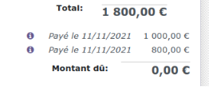
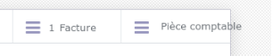

Migration Odoo France Filets 10 vers 15
# ***Visio du 28/01/2022***

|***A Faire***|***Fait le***|
| :- | :-: |
|Pas d’accès à la modification du domaine|03/02/2022|
|La génération du planning PDF ne fonctionne pas|03/02/2022|
|Le PDF « Journal des ventes » n’est pas disponible|03/02/2022|
|Message « Odoo is unbale to merge de PDFs » avec certaines factures => C’est lié aux dernières factures générées au moment de la migration et le PDF n’est pas dispo. Il faut supprimer la pièce jointe (qui n’existe pas réélement) pour pouvoir générer le PDF de la facture|03/02/2022|
|Ajouter des colonnes dans le choix des commandes|03/02/2022|
|Installer pdftk et tester la génération des planning PDF|03/02/2022|
|||

# ***A Faire***

|***A Faire***|***Fait le***|
| :- | :-: |
|Le montant est à 0 dans les règlements|11/11/21|
|Le montant du règlement est à 0 au niveau de la facture|11/11/21|
|
Impossible de faire un règlement sur une facture importée :

You can't register a payment because there is nothing left to pay on the selected journal items.
|11/11/21|
|Voir pour migrer la table des règlements account\_payment au lieu de faire des inserts => Non, car trop de modifications|11/11/21|
|
Revoir le fonctionnement et la migration de cette table :

account\_bank\_statement\_line

=> Migration simplifiée
|11/11/21|
|Importer les pièces jointes|11/11/21|
|Faire le script pour automatiser la sauvegarde de la base, le rsync et repartir d’une base vierge|24/11/21|
|
Gestion des droits (groupes)

france-filets15=# INSERT INTO res\_company\_users\_rel (cid, user\_id) VALUES (1, 9);
|25/11/21|
|PDF Suivi Budget à revoir => La partie Python|25/11/21|
|Élargir le formulaire de la commande et de la facture|25/11/21|
|Migration des données de res\_company (sans migrer la table)|25/11/21|
|Bien récupérer tous les champs dans les règlements (ex : Type de règlement)|25/11/21|
|Fiche de la société à migrer|25/11/21|
|SIRET à ajouter dans res\_partner (venant de res\_company)|05/02/22|
|TVA sur les lignes de commandes|05/02/22|
|Mettre les utilisateurs dans le groupe pour voir la compta|05/02/22|
|Initialiser les séquences (commandes et factures en particulier)|05/02/22|
|Faire une migration en partant d’une base vierge|05/02/22|
|Remettre le logo manuellement dans res\_company|05/02/22|
|Le menu « Analyse facture » retourne des montants à 0|05/02/22|
|Mise en place des sauvegardes du nouveau VPS|05/02/22|
|Installation Grafana|05/02/22|
|||
|Ajouter vue pivot dans facture car n’existe plus||
|||
|
Voir si ce programme pourrait m’aider pour mes migrations

file:///home/tony/SchemaSpy/schemaspy2/index.html

http://dokuwiki/doku.php?id=postgresql:uml&s[]=schemaspy
||
|||
|Ajout du VPS dans ma base de données dans odoo-gestion||
|||

# ***Afficher le plan comptable et les autres menus de la compta***
Pour cela, il faut mettre les utilisateurs dans ce groupe non visible depuis la fiche utilisateur :

Show Accounting Features - Readonly
1. # ***Liens entre les factures et les règlements***
   Exemple de facture :

select am.name,aml.move\_id,aml.id

from account\_move am join account\_move\_line aml on am.id=aml.move\_id

where am.id=1347;

`      `name      | move\_id |  id  

----------------+---------+------

` `FAC/2021/00001 |    1347 | **3209**

` `FAC/2021/00001 |    1347 | 3208

Les règlements sont accessible au bas des factures :

Depuis un règlement il est possible d’accéder à la facture ou à la pièce comptable :

**Remarque** : Les pièces comptable et les factures sont dans la table « account\_move »

Depuis le règlement, il y a un lien directe avec la pièce comptable :

select id,move\_id from account\_payment order by id desc limit 2;

`  `id   | move\_id

-------+---------

` `36551 |    **1349**

` `36550 |    **1348**

select am.name,aml.move\_id,aml.id from account\_move am join account\_move\_line aml on am.id=aml.move\_id where am.id=**1349**;

`       `name        | move\_id |  id  

-------------------+---------+------

` `BNK1/2021/11/0002 |    **1349** | **3213**

` `BNK1/2021/11/0002 |    **1349** | 3212

france-filets15=# select am.name,aml.move\_id,aml.id from account\_move am join account\_move\_line aml on am.id=aml.move\_id where am.id=**1348**;

`       `name        | move\_id |  id  

-------------------+---------+------

` `BNK1/2021/11/0001 |    **1348** | **3211**

` `BNK1/2021/11/0001 |    **1348** | 3210

Mais il n’y a pas de lien directe avec la facture, car il peut y avoir plusieurs règlements pour une même facture ou un seul règlement pour plusieurs factures.

La table « account\_partial\_reconcile » fait le lien entre les lignes des factures et les lignes de la piece comptable attachée au règlement :  

select id, debit\_move\_id, credit\_move\_id, full\_reconcile\_id from account\_partial\_reconcile where debit\_move\_id=3209;

` `id  | debit\_move\_id | credit\_move\_id | full\_reconcile\_id

-----+---------------+----------------+-------------------

` `637 |          **3209** |           **3213** |               636

` `636 |          **3209** |           **3211** |               636

Conclusion : La ligne de facture **3209**, est attachée aux lignes des pièces comptables  **3213** et  **3211**, car elle a 2 règlements

1. # ***Modification style mise en page***
Style error

The style compilation failed, see the error below. Your recent actions may be the cause, please try reverting the changes you made.

Could not get content for /web/static/src/legacy/scss/asset\_styles\_company\_report.scss defined in bundle 'web.report\_assets\_common'.

Issue : https://github.com/odoo/odoo/issues/49456

En fait le fichier indiqué n’existe pas physiquement dans le module web. Une pièce jointe est ajoutée dans ir\_attachment contenant le contenu directement en base de données et le champ URL indique l’url fictive de ces données

Il faut donc remettre ces données dans ir\_attachment après la migration de la base en repartant de la base vierge :

france-filets15=# select id,name,url,store\_fname from ir\_attachment where id=12;

` `id |       name       |                             url                              |                 store\_fname                 

----+------------------+--------------------------------------------------------------+---------------------------------------------

` `12 | res.company.scss | **/web/static/src/legacy/scss/asset\_styles\_company\_report.scss** | f6/f6d02e80c92620f1fcc6b230c02d645dd3010917

france-filets15-vierge=# select id,name,url,store\_fname from ir\_attachment where url is not null;

` `id |                name                 |                             url                              |                 store\_fname                 

----+-------------------------------------+--------------------------------------------------------------+---------------------------------------------

` `12 | res.company.scss                    | /web/static/src/legacy/scss/asset\_styles\_company\_report.scss | f6/f6d02e80c92620f1fcc6b230c02d645dd3010917

` `85 | web.assets\_common.min.css           | /web/assets/85-32a758f/web.assets\_common.min.css             | 5a/5a0d2945e10e819667a6e2f5d9160a60a3d6af3d

` `86 | web.assets\_backend.min.css          | /web/assets/86-e70ce71/web.assets\_backend.min.css            | 1b/1bd638c563dfcaf96566a1292458f1569f59b94a

` `87 | web.assets\_common.min.js            | /web/assets/87-32a758f/web.assets\_common.min.js              | ed/ed5a3829aa06094dcc95b74ad95f654a9f2d4d55

` `88 | web.assets\_backend.min.js           | /web/assets/88-e70ce71/web.assets\_backend.min.js             | 4f/4f6d37e439b94a9a3814da62a5a8eb13ede3d482

` `89 | web.assets\_backend\_prod\_only.min.js | /web/assets/89-5ae6ea9/web.assets\_backend\_prod\_only.min.js   | 01/01ac0f92c06008f78f3d077afbf0a9935f5aa36f

` `90 | web\_editor.assets\_wysiwyg.min.css   | /web/assets/90-4a95993/web\_editor.assets\_wysiwyg.min.css     | ad/adcff3c3867f52b2c5b650906ff2dc7c48559c35

` `91 | web\_editor.assets\_wysiwyg.min.js    | /web/assets/91-4a95993/web\_editor.assets\_wysiwyg.min.js      | 7b/7ba3b14aa6ffd012e3b8db31f913458a6453f742

` `92 | web.report\_assets\_common.min.css    | /web/assets/92-34b1c61/web.report\_assets\_common.min.css      | 15/1593608a8fd82e59b4f5d719cbe205a2e7516082

` `93 | web.assets\_frontend.min.css         | /web/assets/93-f71c1d1/web.assets\_frontend.min.css           | b6/b6946cd14583ce0a1684e26dca80709f3b0f0baa

` `94 | web.assets\_common\_minimal.min.js    | /web/assets/94-346a13e/web.assets\_common\_minimal.min.js      | 41/41e3f905dbc6d452d903363dc53ab58b7d1ef9b3

` `95 | web.assets\_frontend\_minimal.min.js  | /web/assets/95-054374f/web.assets\_frontend\_minimal.min.js    | 9f/9f228642eb3ab4a1ef8d2a12468dc2c2b8ef9ab9

` `96 | web.assets\_common\_lazy.min.js       | /web/assets/96-a76c84b/web.assets\_common\_lazy.min.js         | 05/05fb4dc61affc722a75093cc6f84040002f75ed9

` `97 | web.assets\_frontend\_lazy.min.js     | /web/assets/97-011e75e/web.assets\_frontend\_lazy.min.js       | ee/ee68369850f2a56720b18029bfec196df47fb330
|
*nfoSaône - 1 rue Jean Moulin 21110 Pluvault - http://www.infosaone.com*

*Tony Galmiche - Tél : 03 80 47 93 81 - Portable : 06 19 43 39 31 - Courriel :  tony.galmiche@infosaone.com*
|*age 4/4**|
| :- | :-: |
