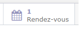

Migration Odoo Nouvelle trajectoire 8 vers 14
1. # ***A Faire***

   |***A Faire***|***Fait le***|
   | :- | :-: |
   |Impossible d’installer le module eLeanring (problème avec res.user.1 et res.users.2)|06/02/21|
   |Migration calendar\_event|14/01/21|
   |Masquer le menu « Discussions »|21/01/21|
   |
Migrer pièces jointes « Base documentaire »

=> Ajouter tchat en dessous pour avoir les pièces jointes
|21/01/21|
   |Migrer les logos de res\_partner dans ir\_attachement|14/01/21|
   |
Migration des logos des entreprises

Il faut migrer le contenu de ces champ dans « ir\_attachement »

image, image\_medium, image\_small
|14/01/21|
   |Bug d’affichage lors de la création d’un RDV => Il faut recharger la page pour voir apparaître le RDV||
   |
Le nombre de RDV affichés n’est pas le bon :

Quand je clique sur cet icône, je ne vois pas les RDV créés avec les activités, sauf si je rafraîchis la page
||
   |
crm\_phonecall => Cette table n’existe plus => Migrer dans mail\_activity ?

Voir pour installer le module « crm\_phonecall » dispoble pour Odoo 13 :

https://odoo-community.org/shop/product/crm-phone-calls-888

Il y a aussi un PR pour la version 14 :

https://github.com/OCA/crm/pull/364
|14/01/21|
   |Prévoir la traduction des champs du module communtaire crm\_phonecall|14/01/21|
   |Migration des groupes|11/01/21|
   |Migration des mots de passe|11/01/21|
   |Automatiser migration des pièces jointes|14/01/21|
   |res\_partner à vérifier => Partie compta (ir\_properties)||
   |
Bug connexion avec olivier.nouvelletrajectoire@gmail.com

2020-12-27 15:06:07,272 6276 WARNING nouvelle-trajectoire14\_migre odoo.http: Access to unauthorized or invalid companies.

Il fallait migrer cette table :

res\_company\_users\_rel
|11/01/21|
   |Finaliser migration du module (res\_partner\_view)|14/01/21|
   |Migrer les étiquettes de res\_partner|14/01/21|

   # ***Migration des groupes***
   nouvelle-trajectoire8=# select ir.name,g.name,count(\*) from res\_groups\_users\_rel r inner join res\_groups g on r.gid=g.id inner join res\_users u on r.uid=u.id left outer join ir\_module\_category ir on g.category\_id=ir.id  group by ir.name,g.name  order by ir.name,g.name;

   `         `name         |                   name                   | count

   ----------------------+------------------------------------------+-------

   ` `Accounting & Finance | Accountant                               |     5

   ` `Accounting & Finance | Financial Manager                        |     5

   ` `Accounting & Finance | Invoicing & Payments                     |     5

   ` `Administration       | Access Rights                            |     1

   ` `Administration       | Settings                                 |     1

   ` `Human Resources      | Employee                                 |    17

   ` `Human Resources      | Manager                                  |     4

   ` `Human Resources      | Officer                                  |     4

   ` `Knowledge            | User                                     |     5

   ` `Project              | Manager                                  |     5

   ` `Project              | User                                     |     5

   ` `Purchases            | Manager                                  |     5

   ` `Purchases            | User                                     |     5

   ` `Sales                | Manager                                  |     6

   ` `Sales                | See all Leads                            |     6

   ` `Sales                | See Own Leads                            |     6

   ` `Sharing              | User                                     |     3

   ` `Technical Settings   | Do Not Use Sales Teams                   |    17

   ` `Technical Settings   | Manage Multiple Locations and Warehouses |     5

   ` `Usability            | Technical Features                       |     1

   ` `Warehouse            | Manager                                  |     5

   ` `Warehouse            | User                                     |     5

   `                      `| Contact Creation                         |    17

   `                      `| Portal                                   |     1

   `                      `| Public                                   |     1

   (25 lignes)

   nouvelle-trajectoire14\_migre=# select ir.name,g.name,count(\*) from res\_groups\_users\_rel r inner join res\_groups g on r.gid=g.id inner join res\_users u on r.uid=u.id left outer join ir\_module\_category ir on g.category\_id=ir.id  group by ir.name,g.name  order by ir.name,g.name;

   `      `name      |                         name                         | count

   ----------------+------------------------------------------------------+-------

   ` `Administration | Access Rights                                        |     2

   ` `Administration | Settings                                             |     2

   ` `Attendances    | Administrator                                        |     3

   ` `Attendances    | Manual Attendance                                    |     3

   ` `Attendances    | Officer                                              |     3

   ` `Employees      | Administrator                                        |     3

   ` `Employees      | Kiosk Attendance                                     |     3

   ` `Employees      | Officer                                              |     3

   ` `Extra Rights   | Contact Creation                                     |     3

   ` `Extra Rights   | Technical Features                                   |     3

   ` `Inventory      | Administrator                                        |     3

   ` `Inventory      | User                                                 |     3

   ` `Invoicing      | Billing                                              |     3

   ` `Invoicing      | Billing Administrator                                |     3

   ` `Project        | Administrator                                        |     3

   ` `Project        | User                                                 |     3

   ` `Purchase       | Administrator                                        |     3

   ` `Purchase       | User                                                 |     3

   ` `Sales          | Administrator                                        |     3

   ` `Sales          | User: All Documents                                  |     3

   ` `Sales          | User: Own Documents Only                             |     3

   ` `Technical      | Access to Private Addresses                          |     3

   ` `Technical      | Access to export feature                             |     3

   ` `Technical      | Send an automatic reminder email to confirm delivery |     3

   ` `Technical      | Tax display B2B                                      |     5

   ` `Timesheets     | Administrator                                        |     3

   ` `Timesheets     | Approver                                             |     3

   ` `Timesheets     | See own timesheets                                   |     3

   ` `User types     | Internal User                                        |     3

   ` `User types     | Portal                                               |     1

   ` `User types     | Public                                               |     1

   (31 lignes)
   1. ## **Migration des logos des entreprises**
      I am using this code to upload image to ir.attachment for product.template and it works for me. Hope it will help. Odoo will automatically add records for image\_medium and image\_small.

      `   `$imageBase64 = base64\_encode(file\_get\_contents('path\_to\_your\_file/image.png'));

      `   `$models->execute\_kw($db, $uid, $password,

      `    `'ir.attachment',

      `    `'create', // Function name

      `        `array( // Values-array

      `            `array( // First record

      `                `'res\_model'=>'product.template',

      `                `'name' => 'image',

      `                `'res\_field' => 'image',

      `                `'res\_id'=> 1234,

      `                `'res\_name' => 'product\_name',

      `                `'type' => 'binary',

      `                `'datas' => $imageBase64

      `            `)

      `        `)

      `    `);

      odoo@buster:/$ echo "select id,name,res\_model,res\_field,res\_id,company\_id,type,store\_fname,file\_size,checksum,mimetype,index\_content from ir\_attachment order by id desc limit 6" | psql nouvelle-trajectoire14\_migre

      `  `id  |              name               |  res\_model  | res\_field  | res\_id | company\_id |  type  |                 store\_fname                 | file\_size |                 checksum                 |        mimetype        | index\_content

      ------+---------------------------------+-------------+------------+--------+------------+--------+---------------------------------------------+-----------+------------------------------------------+------------------------+---------------

      ` `1465 | image\_1024                      | res.partner | image\_1024 |     95 |          1 | binary | ed/ed92741ffe0b99b29f47249bbfd3a9e475f0a701 |    168803 | ed92741ffe0b99b29f47249bbfd3a9e475f0a701 | image/png              | image

      ` `1464 | image\_256                       | res.partner | image\_256  |     95 |          1 | binary |

      pdf = self.env['report'].get\_pdf(obj, 'is\_plastigray.report\_cde\_ouverte\_fournisseur')

      vals = {

      `	`'name': name,

      `	`'datas\_fname': name,

      `	`'type': 'binary',

      `	`'res\_model': model,

      `	`'res\_id': obj.id,

      `	`'datas': pdf.encode('base64'),

      }

      `                `attachment\_id=self.create\_ferme\_uniquement(name)

      `                `attachment = attachment\_obj.browse(attachment\_id)

      `                `pdfreport\_id, pdfreport\_path = tempfile.mkstemp(suffix='.pdf', prefix='order.tmp1.')

      `                `f = open(pdfreport\_path,'wb')

      `                `f.write(attachment.datas.decode('base64'))

      `                `f.close()

      # #\*\* ir\_attachment \*\*\*\*\*\*\*\*\*\*\*\*\*\*\*\*\*\*\*\*\*\*\*\*\*\*\*\*\*\*\*\*\*\*\*\*\*\*\*\*\*\*\*\*\*\*\*\*\*\*\*\*\*\*\*\*\*\*\*\*\*

      # SQL="""

      #     update ir\_attachment set res\_field='image\_128'  where res\_field='image\_small';

      #     update ir\_attachment set res\_field='image\_1920' where res\_field='image';

      # """

      # cnx\_dst,cr\_dst=GetCR(db\_dst)

      # cr\_dst.execute(SQL)

      # cnx\_dst.commit()

      # #\*\*\*\*\*\*\*\*\*\*\*\*\*\*\*\*\*\*\*\*\*\*\*\*\*\*\*\*\*\*\*\*\*\*\*\*\*\*\*\*\*\*\*\*\*\*\*\*\*\*\*\*\*\*\*\*\*\*\*\*\*\*\*\*\*\*\*\*\*\*\*\*\*\*\*\*\*\*

      ## **Problème installation module eCommerce après migration**
      The above exception was the direct cause of the following exception:

      Traceback (most recent call last):

      `  `File "/opt/odoo-14/odoo/http.py", line 638, in \_handle\_exception

      `    `return super(JsonRequest, self).\_handle\_exception(exception)

      `  `File "/opt/odoo-14/odoo/http.py", line 314, in \_handle\_exception

      `    `raise exception.with\_traceback(None) from new\_cause

      odoo.tools.convert.ParseError: while parsing /opt/odoo-14/addons/website/security/website\_security.xml:11, near

      <record id="group\_website\_designer" model="res.groups">

      `        `<field name="name">Editor and Designer</field>

      `        `<field name="users" eval="[(4, ref('**base.user\_root**')), (4, ref('**base.user\_admin**'))]"/>

      `        `<field name="implied\_ids" eval="[(4, ref('group\_website\_publisher'))]"/>

      `        `<field name="category\_id" ref="base.module\_category\_website\_website"/>

      `    `</record>

      J’ai essayé de passé en super-admin, mais le résultat était le même

      odoo.tools.convert.ParseError: while parsing /opt/odoo-14/addons/website/security/website\_security.xml:18, near

      <record id="**base.default\_user**" model="res.users">

      `        `<field name="groups\_id" eval="[(4, ref('group\_website\_designer'))]"/>

      `    `</record>

      <record id="base.group\_system" model="res.groups">

      `        `<field name="implied\_ids" eval="[(4, ref('website.group\_website\_designer'))]"/>

      `    `</record>

      C’est un problème de configuration des groupes des utilisateurs super-amdin (uid=1) et public/defaut (uid=3)
      ## **nouvelle-trajectoire14**
      select res\_id,module,name from ir\_model\_data where model='res.users' order by res\_id ;

      ` `res\_id | module |          name           

      --------+--------+-------------------------

      `      `1 | base   | user\_root

      `      `2 | base   | user\_admin

      `      `3 | base   | default\_user

      `      `4 | base   | public\_user

      `      `5 | base   | template\_portal\_user\_id

      select id,login from res\_users order by id;

      ` `id |     login      

      ----+----------------

      `  `1 | \_\_system\_\_

      `  `2 | admin

      `  `3 | default

      `  `4 | public

      `  `5 | portaltemplate

   1. ## **nouvelle-trajectoire14\_migre**
      select res\_id,module,name from ir\_model\_data where model='res.users' order by res\_id ;

      ` `res\_id |   module   |          name           

      --------+------------+-------------------------

      `      `1 | base       | user\_root

      `      `2 | base       | user\_admin

      `      `3 | base       | default\_user

      `      `4 | base       | public\_user

      `      `5 | base       | template\_portal\_user\_id

 

      select id,login from res\_users order by id;

      ` `id |                  login                   

      ----+------------------------------------------

      `  `1 | \_\_system\_\_

      `  `2 | admin

      `  `3 | public

      `  `4 | portaltemplate
      ##
      ## **Problème**
      <record id="**base.group\_system**" model="res.groups">

      `    `<field name="implied\_ids" eval="[(4, ref('website.group\_website\_designer'))]"/>

      </record>
   1. ## **nouvelle-trajectoire14\_migre**
      select res\_id,module,name

      from ir\_model\_data where model='res.groups' and module='base' order by res\_id;

      ` `res\_id | module |          name           

      --------+--------+-------------------------

      `      `1 | base   | group\_user

      `      `2 | base   | group\_erp\_manager

      `      `3 | base   | group\_system

      `      `4 | base   | group\_multi\_company

      `      `5 | base   | group\_multi\_currency

      `      `6 | base   | group\_no\_one

      `      `7 | base   | group\_allow\_export

      `      `8 | base   | group\_partner\_manager

      `      `9 | base   | group\_portal

      `     `10 | base   | group\_public

      `     `11 | base   | group\_private\_addresses

      (11 lignes)
   1. ## **nouvelle-trajectoire14**
      select res\_id,module,name from ir\_model\_data where model='res.groups' and module='base' order by res\_id;

      ` `res\_id | module |          name           

      --------+--------+-------------------------

      `      `1 | base   | group\_user

      `      `2 | base   | group\_erp\_manager

      `      `3 | base   | group\_system

      `      `4 | base   | group\_multi\_company

      `      `5 | base   | group\_multi\_currency

      `      `6 | base   | group\_no\_one

      `      `7 | base   | group\_allow\_export

      `      `8 | base   | group\_partner\_manager

      `      `9 | base   | group\_portal

      `     `10 | base   | group\_public

      `     `11 | base   | group\_private\_addresses

      (11 lignes)
   1. ## **Problème installation module eCommerce**
      Premier problème :

      <record id="group\_website\_designer" model="res.groups">

      `        `<field name="name">Editor and Designer</field>

      `        `<field name="users" eval="[(4, ref(**'base.user\_root**')), (4, ref('**base.user\_admin**'))]"/>

      `        `<field name="implied\_ids" eval="[(4, ref('group\_website\_publisher'))]"/>

      `        `<field name="category\_id" ref="base.module\_category\_website\_website"/>

      `    `</record>

      Pour résoudre ce problème :

      update res\_users set active='f' where id=1;

      Problème suivant :

      <record id="base.default\_user" model="res.users">

      `        `<field name="groups\_id" eval="[(4, ref('group\_website\_designer'))]"/>

      `    `</record>

      Pour résoudre ce problème :

      delete  from res\_groups\_users\_rel where uid=3;

      update res\_users set active='t' where id=3;

1. # ***Problème avec les PDF***
   J’avais ce message en voulant modifier le modèle des factures :

   The style compilation failed, see the error below. Your recent actions may be the cause, please try reverting the changes you made.

   Could not get content for /web/static/src/scss/asset\_styles\_company\_report.scss defined in bundle 'web.report\_assets\_common'.

   J’ai essayé cela sans succès pour recomplier les CSS et les JS :

   nouvelle-trajectoire14\_migre=# delete from ir\_attachment WHERE name SIMILAR TO '%.(js|css)';

   J’ai fait un update du module web qui a généré cette erreur :

   <record id="group\_hr\_user" model="res.groups">

   `        `<field name="name">Officer</field>

   `        `<field name="category\_id" ref="base.module\_category\_human\_resources\_employees"/>

   `        `<field name="implied\_ids" eval="[(6, 0, [ref('base.group\_private\_addresses'), ref('base.group\_user')])]"/>

   `        `<field name="comment">The user will be able to approve document created by employees.</field>

   `    `</record>

   Je n’ai pas réussi à corriger cette erreur, mais cela a tout de même résolu le problème avec les PDF
   # ***ir\_sequence***
   coheliance8=# select id,name,code,implementation,number\_next

   from ir\_sequence where id in(22,23,24,25,29,43,44,47);

   ` `id |             name             |      code      | implementation | number\_next

   ----+------------------------------+----------------+----------------+-------------

   ` `43 | Affaire                      | is.affaire     | standard       |           1

   ` `23 | Journal des achats           |                | no\_gap         |        3468

   ` `44 | Frais                        | is.frais       | standard       |           1

   ` `47 | Déclaration Frais            | is.fiche.frais | standard       |           1

   ` `24 | Journal des avoirs de ventes |                | no\_gap         |          29

   ` `22 | Journal des ventes           |                | no\_gap         |        1277

   ` `29 | Banque                       |                | no\_gap         |         371

   ` `25 | Journal des avoirs d'achats  |                | no\_gap         |          66

   **implementation = no\_gap**

   coheliance14\_migre=# update ir\_sequence set number\_next=1234 where id=3;

   UPDATE 1

   **implementation = standard**

   coheliance14\_migre=# ALTER SEQUENCE ir\_sequence\_025 RESTART WITH 8888;

   ALTER SEQUENCE
|
*nfoSaône - 1 rue Jean Moulin 21110 Pluvault - http://www.infosaone.com*

*Tony Galmiche - Tél : 03 80 47 93 81 - Portable : 06 19 43 39 31 - Courriel :  tony.galmiche@infosaone.com*
|*age 8/8**|
| :- | :-: |
